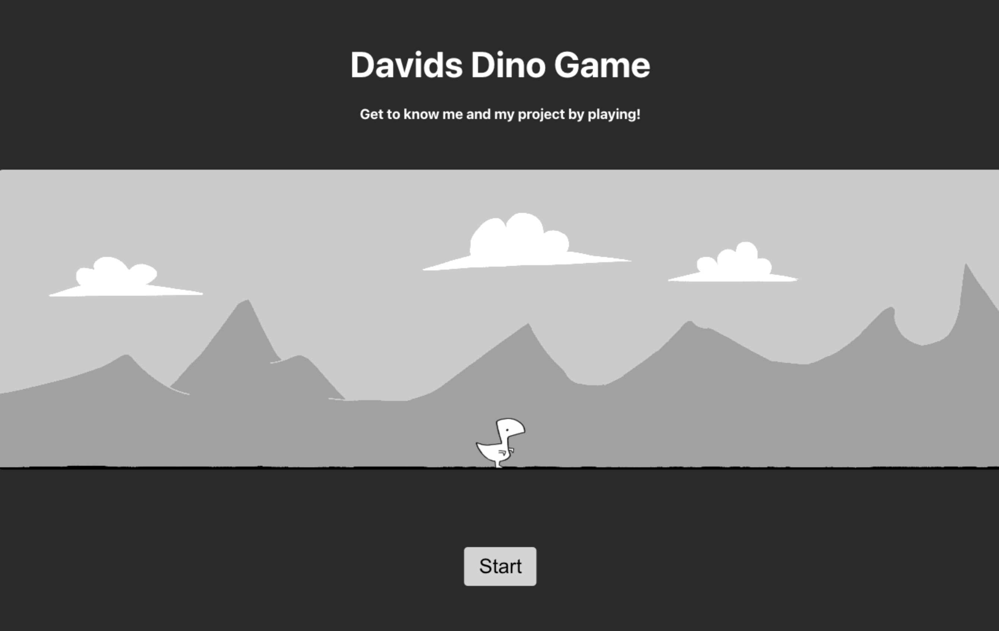

# Davids Cookies - Javascript Assignment

**Author:** David Kjellstrand

Hey! Welcome to Davids Dino Game, a side-project i created while studion Front End Development at Medieinstitutet. Its made with Vue, TypeScript, HTML and CSS. I learned alot during the creation of it and used it as an opertunity to implement audio for the first time. I also created/painted all the visuals, sound effects and music. 

Try it and learn ore about it while playing!

## 🔗 Links

#### Repo
[Repo](https://github.com/Davkje/jumping-game)

#### Live Site
[Try the game!](https://davkje.github.io/jumping-game/)

## Tech Stack

**Languages:** TypeScript, Html, Css, Vue 

## Thanks for "reading-me"!
